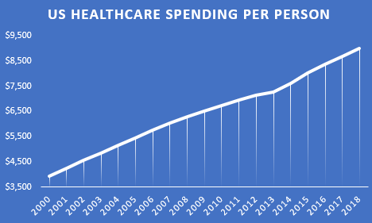
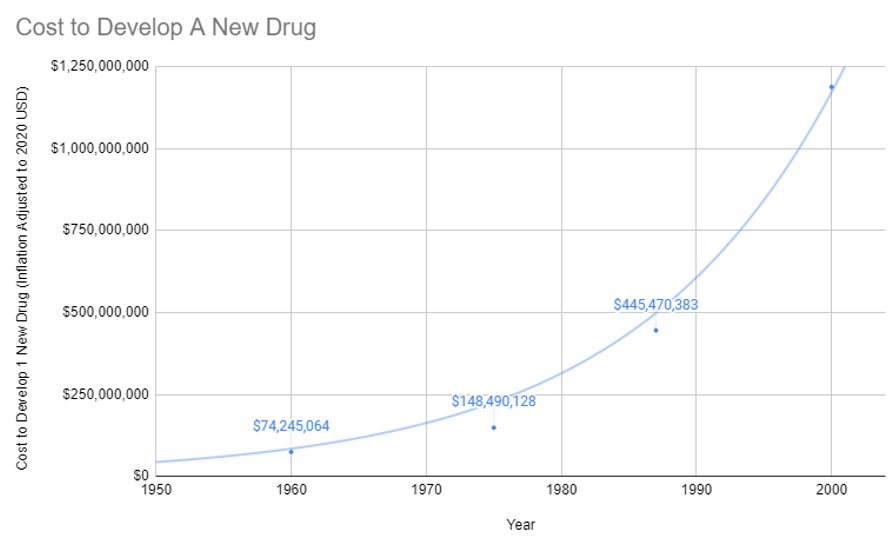
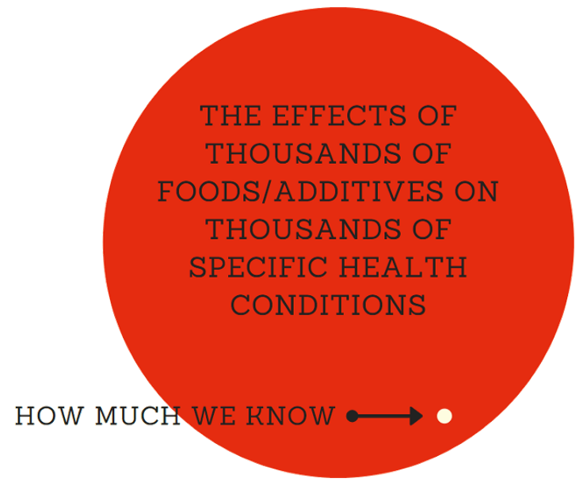
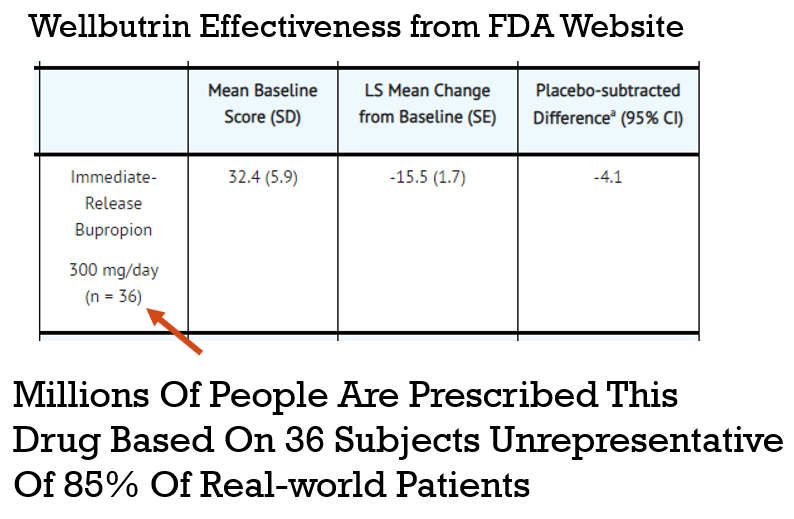

### 👈 [Back to Table of Contents](../README.md)

# 1.    The Problem: You and Everyone You Love Will Suffer and Die

There are over [2 billion](https://www.george-health.com/global-health-challenge/) people suffering from chronic diseases.

Additionally, [150,000](https://www.weforum.org/agenda/2020/05/how-many-people-die-each-day-covid-19-coronavirus/)
people die every single day. For perspective, this is equivalent to:

- **[FIFTY-ONE](https://en.wikipedia.org/wiki/Casualties_of_the_September_11_attacks)** September 11th
  attacks
  every day
- **[NINE](https://en.wikipedia.org/wiki/Casualties_of_the_September_11_attacks)** Holocausts every year

**Will throwing more money at the existing healthcare system save us?**

Since 2014, healthcare spending per person has been [increasing faster than ever](https://fred.stlouisfed.org/series/HLTHSCPCHCSA) faster than ever before.

Despite this additional spending, life expectancy has actually been [declining](../assets/life-expectancy/life-expectancy-chart.png)
since 2014.

**Will digital health innovation save us?**

There has been an explosion of recent technological advances in digital health including:

* genetic sequencing
* gut microbiome sequencing
* [350,000](https://www2.deloitte.com/us/en/blog/health-care-blog/2021/how-digital-health-apps-are-empowering-patients.html) digital health apps
* a [billion](https://www.statista.com/statistics/487291/global-connected-wearable-devices/) connected wearable devices

These innovations have produced [50-fold](https://www.weforum.org/agenda/2015/10/who-should-own-our-health-data/) growth in the amount of data on every disease and every factor that could improve, exacerbate, or prevent it.
([chart](../assets/data/growth-in-health-data-chart.png))

This data exists in the form of:

- Electronic Medical Records
- Nutritional Supplement Purchases
- Data from diet and treatment tracking apps
- Genetic Sequencing
- Health insurance claims
- Grocery, pharmacy, and nutritional supplement receipts
- Clinical trial results

The digital health revolution started over a decade ago. It was promised to improve human health and reduce costs. Yet,
all we've seen is increasing costs, increasing disease burden, and decreasing life expectancy.

**Why haven't we seen a reduction in disease burden?**

So, this explosion in technology, data, and spending has produced no measurable improvement in human health.  The reason, in a single word, is **incentives**. The current economic system punishes every stakeholder in the ecosystem for doing the things that would lead to progress.

## 1.2 Problems in Clinical Research

### 1.2.1 The Cost of Clinical Research

It costs over a [billion dollars](https://www.semanticscholar.org/paper/Innovation-in-the-pharmaceutical-industry%3A-New-of-DiMasi-Grabowski/3275f31c072ac11c6ca7a5260bd535720f07df41) and takes over 10 years to bring a new treatment to market. It
costs [$41k](https://www.clinicalleader.com/doc/getting-a-handle-on-clinical-trial-costs-0001#:~:text=The%20clinical%20trials%20cost%20a,and%20benchmarking%20clinical%20trial%20costs.) per subject in Phase III clinical trials.

This leads to the following problems:

#### No Data on Unpatentable Molecules

We still know next to nothing about the long-term effects of 99.9% of the 4 pounds of over [7,000](https://www.dailymail.co.uk/health/article-8757191/Are-additives-food-making-ill.html) different synthetic or natural chemicals you consume every day.

Under the current system of research, it costs [$41k](https://www.clinicalleader.com/doc/getting-a-handle-on-clinical-trial-costs-0001#:~:text=The%20clinical%20trials%20cost%20a,and%20benchmarking%20clinical%20trial%20costs.) per subject in Phase III clinical trials. As a result, there is not a sufficient profit incentive for anyone to research the effects of any factor besides a molecule that can be patented.

#### Lack of Incentive to Discover the Full Range of Applications for Off-Patent Treatments

There are roughly [10,000](https://www.washingtonpost.com/news/fact-checker/wp/2016/11/17/are-there-really-10000-diseases-and-500-cures/) known diseases afflicting humans, most of which (approximately 95%) are classified as “orphan” (rare) diseases. The current system requires that a pharmaceutical company predict a particular condition in advance of running clinical trials. If a drug is found to be effective for other diseases after the patent has expired, no one has the financial incentive to get it approved for another disease.

#### No Long-Term Outcome Data

Even if there is a financial incentive to research a new drug, there is no data on the long-term outcomes of the drug. The data collection period for participants can be as short as several months.  Under the current system, it's not financially feasible to collect data on a participant for years or decades.  So we have no idea if the long-term effects of a drug are worse than the initial benefits.

For instance, even after controlling for co-morbidities, the Journal of American Medicine recently found that long-term use of Benadryl and other anticholinergic medications is associated with an [increased](https://jamanetwork.com/journals/jamainternalmedicine/fullarticle/2091745) risk for dementia and Alzheimer disease.

### 1.2.2 Conflicts of Interest

Long-term randomized trials are extremely expensive to set up and run. When billions of dollars in losses or gains are riding on the results of a study, this will almost inevitably influence the results. For example, an analysis of beverage studies, [published in the journal PLOS Medicine,](https://web.archive.org/web/20211207021133/https://journals.plos.org/plosmedicine/article?id=10.1371/journal.pmed.1001578#s3) found that those funded by Coca-Cola, PepsiCo, the American Beverage Association, and the sugar industry were **five times** more likely to find no link between sugary drinks and weight gain than studies whose authors reported no financial conflicts.

The economic survival of the pharmaceutical company is dependent on the positive outcome of the trial.  While there's
not a lot of evidence to support that there's any illegal manipulation of results, it leads to two problems:

#### Negative Results are Never Published

Pharmaceutical companies that sponsor research often report only “positive” results, leaving out the non-findings or negative findings where a new drug or procedure may have proved more harmful than helpful. Selective publishing can prevent the rapid spread of beneficial treatments or interventions, but more commonly it means that bad news and failure of medical interventions go unpublished. Past analysis of clinical trials supporting new drugs approved by the FDA showed that just [43 percent of more than 900 trials on 90 new drugs](https://www.livescience.com/8365-dark-side-medical-research-widespread-bias-omissions.html) ended up being published. In other words, about 60 percent of the related studies remained unpublished even five years after the FDA had approved the drugs for market. That meant physicians were prescribing the drugs and patients were taking them without full knowledge of how well the treatments worked.

This leads to a massive waste of money by other companies repeating the same research and going down the same dead-end streets that could have been avoided.

### 1.2.3 Trials Often Aren't Representative of Real Patients

External validity is the extent to which the results can be generalized to a population of interest. The population of interest is usually defined as the people the intervention is intended to help.

Phase III clinical trials are designed to exclude a vast majority of the population of interest. In other words, the subjects of the drug trials are not representative of the prescribed recipients, once said drugs are approved. One investigation found that only [14.5%](https://www.ncbi.nlm.nih.gov/pubmed/14628985) of patients with major depressive disorder fulfilled eligibility requirements for enrollment in an antidepressant efficacy trial.

As a result, the results of these trials are not necessarily generalizable to patients matching any of these criteria:

* Suffer from multiple mental health conditions (e.g. post-traumatic stress disorder, generalized anxiety disorder, bipolar disorder, etc.)
* Engage in drug or alcohol abuse
* Suffer from mild depression (Hamilton Rating Scale for Depression (HAM-D) score below the specified minimum)
* Use other psychotropic medications

These facts call into question the external validity of standard efficacy trials.

Furthermore, patient sample sizes are very small. The number of subjects per trial on average:

* [275](https://www.ncbi.nlm.nih.gov/books/NBK50886/) patients are sought per cardiovascular trial
* [20](https://www.ncbi.nlm.nih.gov/books/NBK50886/) patients per cancer trial
* [70](https://www.ncbi.nlm.nih.gov/books/NBK50886/) patients per depression trial
* [100](https://www.ncbi.nlm.nih.gov/books/NBK50886/) per diabetes trial

### **Solution: Collect Data on Actual Patients**

In the real world, no patient can be excluded. Even people with a history of drug or alcohol abuse, people on multiple medications, and people with multiple conditions must be treated. Only through the crowdsourcing of this research, would physicians have access to the true effectiveness rates and risks for their real-world patients.

The results of crowd-sourced studies would exhibit complete and utter external validity since the test subjects are identical to the population of interest.

Furthermore, self-trackers represent a massive pool of potential subjects dwarfing any traditional trial cohort.
Diet tracking is the most arduous form of self-tracking. Yet, just one of the many available diet tracking apps, **MyFitnessPal,** has 30 million users.

Tracking any variable in isolation is nearly useless in that it cannot provide the causal which can be derived from combining data streams. Hence, this 30 million user cohort is a small fraction of the total possible [stratifiable](https://en.wikipedia.org/wiki/Stratified_sampling) base.

## Criticism of Observational Research

## 1.3 Problems in Digital Health Innovation

### 1.3.1   $157 Billion Wasted on Duplication of Effort

There are more than [350,000](https://www.emarketer.com/content/over-350k-digital-health-apps-flooding-market-here-s-how-apps-stand) health apps. Mobile health app development costs [$425,000](https://www.mobihealthnews.com/content/mobile-health-app-development-costs-425000-average-likely-continuing-rise) on average.  Most of these
have a ton of overlap in functionality representing [$157,500,000,000](https://www.mobihealthnews.com/content/mobile-health-app-development-costs-425000-average-likely-continuing-rise) wasted on duplication of effort.

If this code was freely shared, everyone could build on what everyone else had done could increase the rate of
progress by 350,000 times.

The obstacle has been the free-rider problem. Software Developers that open source their code give their
closed-source competitors an unfair advantage.  This increases their likelihood of bankruptcy even higher than the 90% failure rate they already faced.

#### How DAOs Overcomes the Free-Rider Problem

1. Currently governments around the world are spending billions funding closed-source propriety health software. The
   Public Money Public Code initiative would require governments to recognize software as a [public good](https://en.wikipedia.org/wiki/Public_good_(economics)) and require that publicly-funded software be open source.
2. By encoding contributions to the project with NFTs, we can guarantee ongoing compensation in the
   form of royalties.

### 1.3.2 Isolated Data Silos

The best that isolated data on individual aspects of human health can do is tell us about the past. For example,
dashboards telling us how many steps we got or how much sleep we got are known as “descriptive statistics”.  However,
by integrating all available data from individuals, similar populations, as well as existing clinical research
findings and applying machine learning we may achieve “prescriptive” real-time decision support.

To facilitate data sharing, the DAO will provide data providers with an onsite easily provisionable OAuth2 API server that will allow individuals to anonymously share their data with the global biobank.

## 1.4 Lack of knowledge about the underlying root of degenerative diseases -> aging

If we would have reliable biomarkers for aging already, research could find interventions for the root cause of degenerative diseases which is aging itself.
Despite many years of research, we still don’t have reliable biomarkers for aging.  One of the main problems is the distance between genotype and phenotype.  It is proposed that by studying the relationships between proteins and metabolites, essentially a multi-omic process, would allow the creation of “endophenotypes” to help identify a signature (Hoffman et al. 2017).

### Problems with current biomarkers for aging:
Hundreds of genes found to affect aging in model organisms do not have significant association with longevity in humans. 
Humans are genetically diverse in comparison to model organisms and this contributes to the weak signature of any set of genes towards longevity.
Environmental effects on aging are relatively unknown.

### Problems with current approaches:
A genome-wide association study (GWAS) is an approach used in genetics research to associate specific genetic variations with particular diseases. GWAS can only explain a small fraction of the heritability of many human traits, including aging. Transcriptomics can help, but it can’t explain the whole story.
Proteomics is actually the enzyme workhorse of biology and the insight into protein levels is especially important.
Metabolomics are the building blocks that proteins work with and is necessary for a better insight into the state of the running system.

Rather than focusing on individual proteins and metabolites, a multi-omics approach can focus on pathway activation and how those pathways are maintained by individual entities and their relationships with each other. We want to identify the difference between young and old network states and be able to tell when an intervention is moving a system towards a more healthy state.

### [Next Solution](./2-solution.md) 👉

This work is licensed under a <a rel="license" href="http://creativecommons.org/licenses/by-nc-sa/4.0/">Creative Commons Attribution-NonCommercial-ShareAlike 4.0 International License</a>.

