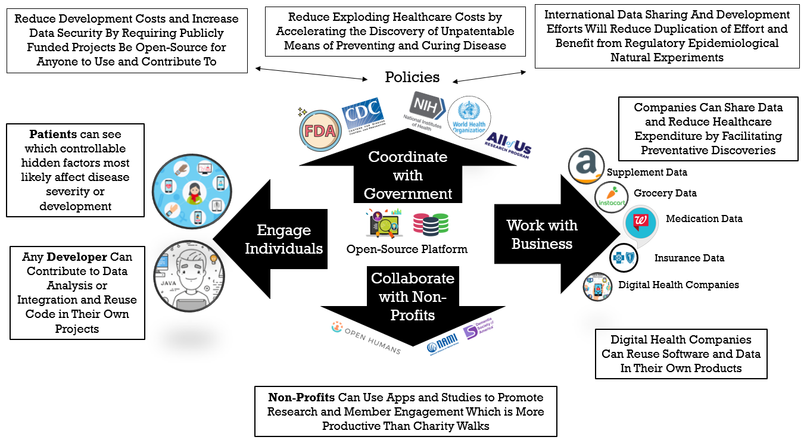
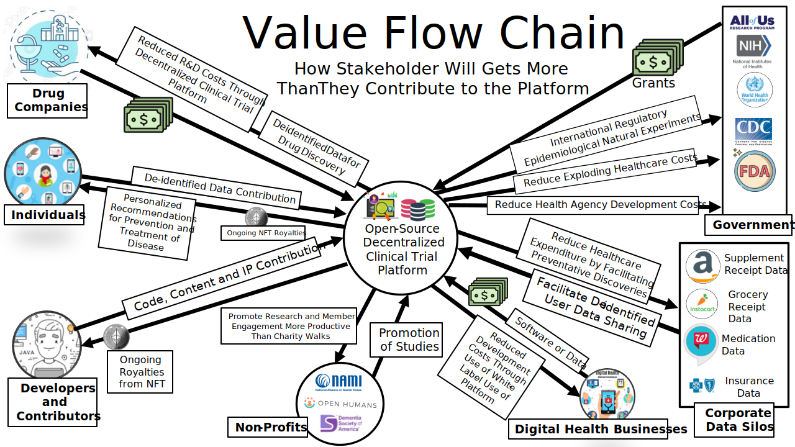
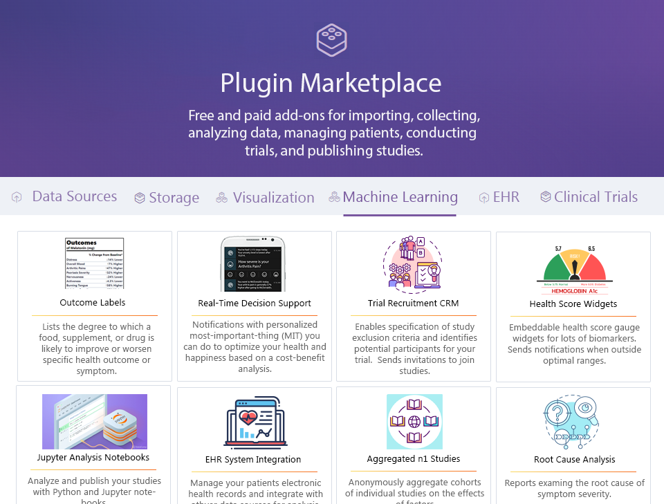

# ❤ Incentivization

👈 [Back to Table of Contents](../)

## Incentive Alignment

Fully realizing the potential of the personalized preventative medicine of the future will require incentivizing cooperation between the following stakeholders:

This illustrates the flow of value between different stakeholders. As opposed to traditional zero-sum games, CureDAO provides a way for each self-interested party can derive more value from participation than they have to put into it.

### 1. Patients

Incentives for Patients to share their de-identified data will include:

1. Actionable ways to prevent and mitigate chronic illnesses.
2. The ability to license and earn a share of income for use of their data for research and development by pharmaceutical companies and other businesses. This will be achieved by encoding the user data using non-fungible tokens (NFTs) and issuing them to the user. The NFTs will be linked to the user's cryptographic wallet address. Using a smart contract, the user will receive an ongoing royalty share of the profits for any product that was developed using their data for research and development.
3. TODO: Determine the amount of reward for sharing.

### 2. Businesses Housing Data Silos

Businesses housing data silos include health insurers, pharmacies, grocery delivery services, digital health apps, hospitals, etc. These will be incentivized to allow individuals to easily share their data via a well-documented OAuth2 API by:

1. A share of income for use of their data for research and development.
2. An on-site instance of the OAuth2 server to retrieve required data from their on-premise databases.
3. An eventual reduction in their employee healthcare costs (one of their largest expenses) by resulting from the discovery of new ways to prevent and mitigate chronic illnesses.

### 4. Digital Health Businesses

On top of the incentives for businesses listed above, the following incentives will be provided to digital health businesses which enable data sharing:

1. A license to use a white-labeled version of the framework. This will dramatically reduce the costs of software development. These reduced costs will allow them to focus on innovating their unique value proposition, making them more competitive in the market.
2. Massive free marketing exposure through company branded plugins in the Plugin Marketplace.
3. Revenue derived through subscription or licensing agreements for usage of their plugins in the Plugin Marketplace.

### 5. Disease Advocacy Non-Profit Organizations

Disease advocacy non-profits will be incentivized to promote observational studies through the anonymous donation data by their members by:

1. Accelerated furtherance of their mission to reduce the incidence of chronic illnesses.
2. A new method of member engagement more motivating and productive than the traditional charity walk.

### 6. Government Health Agencies

Governments will be incentivized by:

1. A reduction in government healthcare costs due to the discovery of new ways to prevent and mitigate chronic illnesses.
2. Furtherance of their stated reason for existence to protect and promote the general welfare. General welfare is defined as the overall health and happiness of the population.
3. Their duty to protect the rights of individuals' data. To fulfill this, they must require businesses in possession of it to give them the ability to access and share their data via a well-documented OAuth2 API
4. Cost-savings from using open-source software. All publicly funded digital-health software projects should be free, secure, and open-source. Currently, the majority of government contracts go to closed-source and proprietary software. This leads to massive waste as governments around the world are paying to reinvent the wheel instead of sharing the costs. Shockingly, there is even a great deal of wasted money on duplicated software contracts between different agencies within the same governments.
5. Require international cooperation for all public health efforts to reduce wasted duplication of effort and take advantage of natural experiments resulting from differing public health regulations between nations.
6. Epidemiological discoveries from allowing citizens to anonymously share their data in a global database. This will enable us to take advantage of natural experiments resulting from differing public health regulations between nations. For instance, 27 countries have banned the use of the pesticide glyphosate due to concerns about the health effects. If no overall change in the health of the populations is observed, it will suggest that the health concerns may be unfounded.

### 7. Contributors to the Development of the Platform

Citizens of the DAO will be incentivized to contribute to the development of the platform by: TODO: Determine amount and type of reward for contributing to the development of the platform by voting here 👉 Vote on the Amount of Compensation for Specific Tasks

### 8. Compensation

Compensation for various tasks will be determined democratically by voting here 👉 [Vote on Compensation for Specific Tasks](https://docs.google.com/forms/d/1zNRRLEOnrQmlbKu33NORJQDktJhgneQHsQtJHW3erL0/edit)

#### [Next Organization](5-organization.md) 👉

This work is licensed under a [Creative Commons Attribution-NonCommercial-ShareAlike 4.0 International License](http://creativecommons.org/licenses/by-nc-sa/4.0/).
